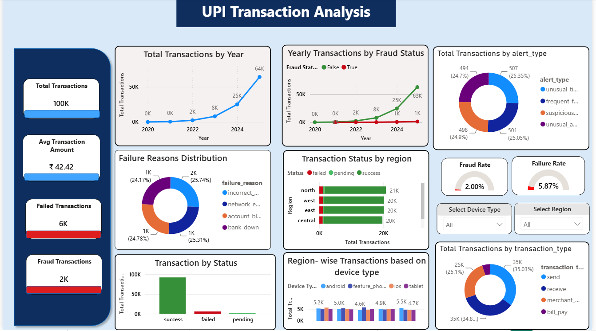

# UPI Transaction Analysis & Risk Dashboard

## 📌 Project Overview
This project focuses on the comprehensive analysis of operational, transactional, and risk data within Unified Payments Interface (UPI) systems. By deep-diving into large-scale payment datasets, the project aims to decode customer and merchant behavioral patterns, identify seasonal payment trends, and detect potential fraud risks. 

Ultimately, this repository provides data-driven insights, key performance indicators (KPIs), and interactive dashboards designed to optimize platform performance and strengthen user trust.

---

## 🚀 Key Features & Objectives

* **Behavioral & Trend Analysis:** Mapping transaction patterns across critical operational vectors, including structural changes over time (Total Transactions by Year), regional distributions, and device type usage (Android, iOS, Feature Phone, Tablet) to pinpoint ecosystem trends.
* **Risk Management & Fraud Detection:** Isolating 2K fraud (2.00% rate) and 6K failed transactions across specific alert types (unusual time, frequent failures, suspicious location, unusual amount) to monitor absolute risk trends.
* **KPI Development:** Formulating actionable high-level business and operational metrics, including Total Transactions (100K), Average Transaction Amount (₹42.42), overall Fraud Rate (2.00%), Failure Rate (5.87%), and definitive counts for failed vs. fraudulent events.
* **Interactive Dashboards & Technical Solutions:** Constructing a robust, executive-ready monitoring interface equipped with dynamic filtering options (Device Type and Region) to allow stakeholders to diagnose localized failure distributions and regional status disparities.
* **Strategic Business Recommendations:** Translating complex data visualizations—such as transaction type breakdowns (Send, Receive, Merchant Payment, Bill Pay) and failure reason distribution (incorrect pin, network error, account blocked, bank down)—into focused operational strategies to maximize successful volume and target underutilized avenues.

---

## 🛠️ Tech Stack & Tools
* **Data Processing & Analytics:** Python (Pandas, NumPy) / SQL
* **Data Visualization:** Power BI / Matplotlib / Seaborn
* **Environment:** Jupyter Notebook / Git

---

## 📊 Dashboard Preview
Below is a glimpse of the interactive dashboard developed for executive and operational tracking:

<p align="center">
  
</p>

---

## 📊 Key Insights Summary
🚀 Rapid 8x transaction growth from 2023 to 2025 signals massive platform adoption, highlighting an urgent need to scale security and anti-fraud systems proportionally.

🛡️ While the fraud rate is stable at 2%, rising absolute transaction volumes scale potential financial exposure (est. ₹84,000), underscoring the need for proactive monitoring.

📉 A 5.87% transaction failure rate causes significant revenue leakage, where recovering just half of these failed payments could reclaim an estimated ₹123,000 without additional customer acquisition costs.

🌍 Regional distribution is well-balanced with the North leading at ~21K transactions, meaning even marginal spikes in Northern fraud or failure rates will disproportionately impact overall losses.

🔄 Peer-to-peer activities (Send/Receive) dominate at ~70% of volume, leaving Bill Pay highly underutilized at 5% and presenting a clear growth opportunity through targeted incentives like cashback or rewards.

---

## 📁 Repository Structure
```text
├── data/          # Sample datasets
├── notebooks/     # Jupyter notebook for data cleaning, transformations, EDA and hypothesis using statistical tests
├── scripts/       # SQL scripts
├── images/        # Dashboard screenshots and visualizations
├── README.md      # Project documentation
